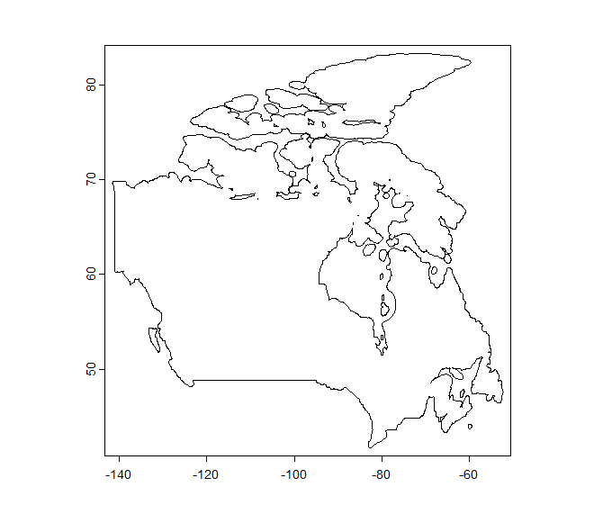
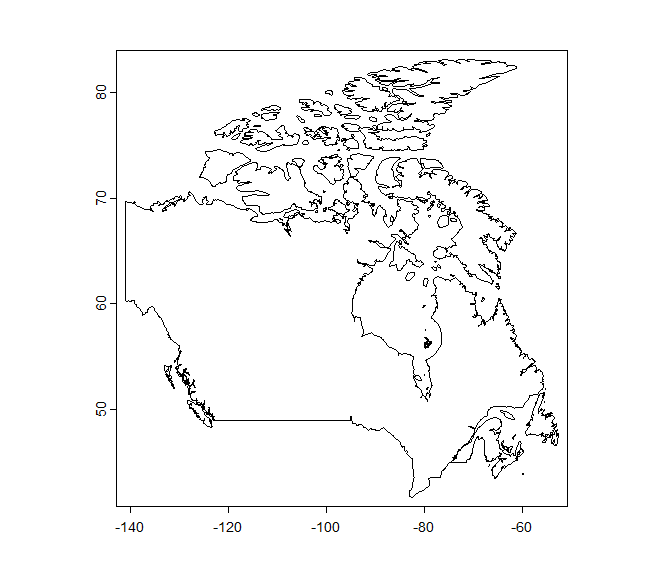
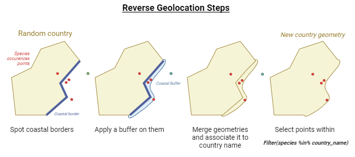
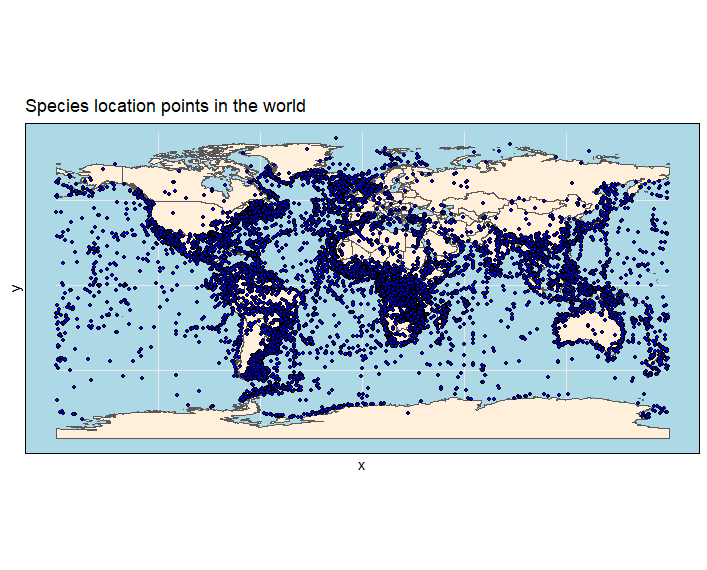
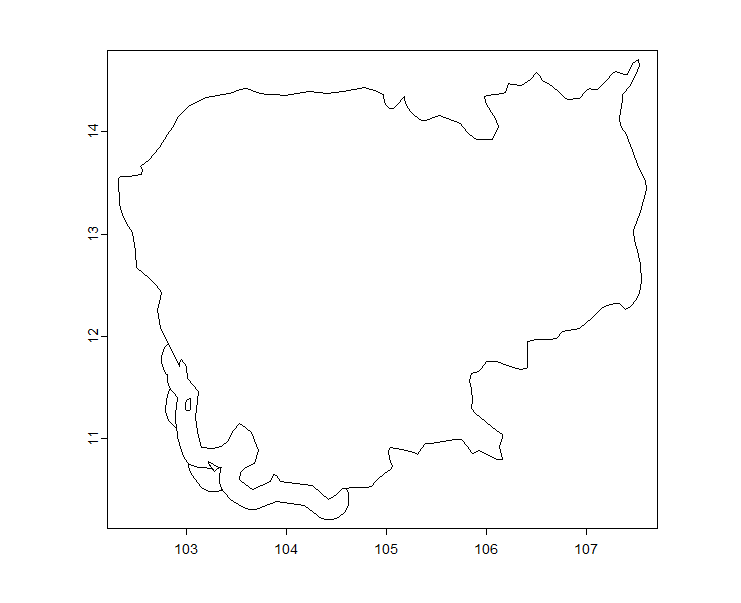

# Preparation of the Data for SDM 

This document is a guide to understand the organization of the **Aquaculture project's Species Distribution Models** scripts.  

The script is organized as such:

    I. Preparation of the Data
          a. World Data 
          b. Species Data
          c. Environmental Data
    II. Data Merge
    III. SDM

---------------------------------------------------------------

### I. Data preparation

**Variables**
- Verify data collinearity: threshold pairwise correlation coefficient value of |r| > .7
- Standardization of the data to a mean of 0 and SD of 1

### 1. World data
The goal is to generate the countries' new geometry. We want to take into account about 22km of the coasts in the country's border geometry, in order to retreive the fish occurrences near the coasts. 

To do so, we use the 'terra' package with this function:
```{r}
buffered_regions <- list()

for(i in seq_along(regions)){
  # Isolate region geometry
  region <- world_vect[world_vect$name == regions[i], ]
  if(regions[i] %in% countries_with_coastline){
    # Draw polygon from coastline
    intersect <- terra::intersect(coastline_vect, region)
    # Crop coastline in targeted area
    crop <- terra::crop( region, intersect)
    # Add a buffer everywhere following the border
    buffer <- buffer(crop, width = 22000) # Apply 22km buffer on all coasts
    # Combine Geometries
    combined <- combineGeoms(region, buffer)
    # Aggregate everything that overlaps in the assembled coast and country SpatVector
    combined_polygons <- aggregate(combined, dissolve = TRUE)
    # Add buffered object
    buffered_regions[i] <- combined_polygons
  } else {
    buffered_regions[i] <- region
  }
} 

buffered_regions_vect <- vect(buffered_regions) # FINAL SPATVECTOR OBJECT  
```

We end up with countries with buffered coasts and normal geometry (e.g. Canada below):
 


<span style="color:#f53d49;"> ISSUE: The polygons that overlap for 1 country end up merging successfully, but not for multiple countries.  </span>


### 2. Species data
After loading the data with the real_bg.rds file and 'rfishbase' package, we need to match the data to the countries' new geometries that act like molds.

To do so, we want to **associate the new geometry to the countries name**, and use this information to do the reverse geolocation. 

**Reverse geolocation** is the process of finding an adress from coordinates. In our case, the country name. 

We need to match up GBIF species occurences coordinates to countries in order to match the targeted species we study to its background data. 

If the targeted species is in India, China, Vietnam and Erytrea, we need to do a sampling of background species present in these countries (with a maximum threshold of 10,000 backgound data). 

Because we did match the coordinates to the new countries geometry (the buffered one on the coast), we will be able to match species coordinates that are off the coast within 22km to the country in question. 

<ins>Steps in diagram:</ins>


#### 2.1 Clean the data
Cleaning the data allows to have a dataset without irrelevant values. 
For that, we use the package 'CoordinateCleaner'. 

We also use the 'distinct' function in order to clean up the repeted rows (same coordinates and same species). The reason we have repeted rows is the fact that we might have same observations for different years. Since we work on a period of time and the year isn't that relevant, we do not include it in the data.

```{r}
Getflag <- function(data){
  # Replace alpha-2 with alpha-3
  indices <- match(data$countryCode, countcode$a2)
  data$countryCode <- countcode$a3[indices]
  # Flags
  flags <- clean_coordinates(x = data, 
                                lon = "decimalLongitude", 
                                lat = "decimalLatitude",
                                countries = "countryCode",
                                species = "species",
                                tests = c("countries"))
  return(flags)
}

data <- distinct(data)
```

#### 2.2 Reverse Geolocation

For the moment, I use the package 'SeaVal' to do the reverse location, but turns out I can't change the reference data for the countries, so I can't add my own data with my changed geometries (i.e. if a point falls on the coast within the buffer, it won't associate it with the nearest country, at least for now).

```{r}
buff_countries <- as_sf(buffered_regions_vect) # We do have the changed geometries
# plot(buff_countries$geometry[31]) # Example with Brazil

# Add countries column in full bg dataframe....
bg_df2 <- tidyterra::rename(bg_df, lon = x, lat = y)
bg_df2 <- as.data.table(bg_df2)
bg_df2 <- add_country_names(bg_df2, regions = buff_countries) # With SeaVal package
bg_df2$country <- gsub(":.*", "", bg_df2$country)  # Delete unused arguments (subregions)
bg_df2 <- tidyterra::rename(bg_df2, x = lon, y = lat) # Rename back the coordinates (useful for later)
# rm(bg_df) ; gc() # Clean memory (CM)
bg_df2 <- na.omit(bg_df2, cols = "country") # Remove NAs in the "country" column

# ...AND aquaspecies dataframe 
# Add countries
aq_df2 <- tidyterra::rename(aquaspecies_df, lon = x, lat = y)
aq_df2 <- as.data.table(aq_df2)
aq_df2 <- add_country_names(aq_df2, regions = buff_countries)
aq_df2$country <- gsub(":.*", "", aq_df2$country)  # Delete unused arguments (subregions)
aq_df2 <- tidyterra::rename(aq_df2, x = lon, y = lat) # Rename back the coordinates (useful for later)
aq_df2 <- na.omit(aq_df2, cols = "country") # Remove NAs in the "country" column
rm(aquaspecies_df, subdf_thrsh) ; gc() # CM

```

Now we are supposed to have dataframes with column names as such: 
"x" "y" "species" "Aquaculture_status" "country"

### 3. Environmental data
- Chosing the right resolution


#### 3.1 Resample

The different layers need to have the same geometry to be projected in the same grid. Therefore, the 'resample' function, of the package 'terra' is used in order to adapt one SpatRaster's geometry to another's. 

```{r}
resample(layer_raw, layer_base, "method")
```
The method will depend on the nature of the variable itself. 
- Nearest neighbor: **Discrete**
- Majority: **Discrete**
- Bilinear: **Continuous**
- Cubic: **Continuous**

        layer.rsp

For the moment, we chose the bilinear method.

**Snap to grid**

Snap to grid is useful to adapt every layer to the same skeleton scaffold. 
Other method if resample() is not used.

```{r}
SnapToGrid <- function(layer){
  df <- as.data.frame(layer,xy=T) # Use the xy dataframe and append the (x,y) values of each cell + index value
  # Resolution
  Dim <- dim(layer) 
  ResX <- Dim[1] # Resolution for x
  ResY <- Dim[2] # Resolution for y 
  DimLayer <- list(ResX, ResY)
  # Extent
  ext <- ext(layer) # Extent for data (terra object)
  xmin <- ext$xmin
  ymin <- ext$ymin
  xmax <- ext$xmax
  ymax <- ext$ymax
  ext.layer <- list(xmin, ymin, xmax, ymax)
  #Delta
  deltaX <- (xmax - xmin)/ResX
  deltaY <- (ymax - ymin)/ResY 
  # Create grid
  df$snapX <- as.integer(((df$x-xmin)/deltaX) + 0.5)
  df$snapY <- as.integer(((df$y-ymin)/deltaY) + 0.5)
  len <- dim(df)
  df$index <- seq(1,len[1])
  # Return
  return(df)
  # list(df, DimLayer, ext.layer)
}
```

        layer.stg (or final.df)


#### 3.2 Mean value

The a fine time scale isn't relevant in our case. The values per month are not interesting, so we compute the mean and replace the raw data by a mean value column into the new dataset. 

```{r}
mean.df <- function(layer, arg){
  name.col <- paste0("mean_", arg)
  # Calculate mean value per row 
  sub.df.mean1 <-  layer %>%
    mutate(name.col =  rowMeans(dplyr::select(., contains(arg)), na.rm = FALSE)) 
  # Subset without raw data
  sub.df.mean2 <- sub.df.mean1 %>%
    dplyr::select(., -contains(arg))
  # Rename column
  names(sub.df.mean2)[names(sub.df.mean2) == 'name.col'] <- toString(name.col)
  # Final df
  return(sub.df.mean2)
}
```
        layer.mn

#### 3.3 Merge dataframes

When the geometry is right for every layer and the mean value is calculated, we want to merge the datasets in order to have all variables in the same space.

```{r}
new.df <- df1 %>%
  left_joint(df2)
```
*use the dplyr package*. The common columns are x and y.
No matter if x and y are different, anyways will be better organized thanks to snap to grid function.

        layer.mg


#### 3.4 Plot the layers

To check if it works, we need to have a visual representation of the final dataframe. 

**Remark: downloading the data per country for the borders takes a lot of time, maybe try for all of them at once?**


### II. Merge data
When the environmental and species dataframes are ready, we can merge them. 

```{r}
Final.df <- function(final, sp){
  coord <- matrix(c(sp$x, sp$y), ncol = 2) # Coordinates from species df
  s <- cellFromXY(temp.min, xy = coord)
  p <- which(!is.na(s))
  s1 <- s[p]
  final$species <- NA
  final$species[s1] <- sp$species[p]
  return(final)
}
```
    finaldf

And we can plot by converting it into a Spatraster. 


**Species data**
- Grid variables (linking environmental data and species data with the same projection):
    - Removing records without all the data of each variables
    - Removing cells with multiple occurrences
    - Standardized cleaning with ‘CoordinateCleaner’ package (*removed any records with equal or zero/zero coordinates, found in urban areas, near biodiversity institutions, outside of their listed country, or at the centroids of countries and its subdivisions*)
    - Selection of the data within the time period of interest
- Classification of species occurrences by species type (criteria depending on the contex of the study) and at the chosen point of view and scale (absolute distance, habitat) = ranges
- Remove points with not enough occurrences to avoid overfitting


**Background environment selection**
Fitting of the model with presence background data -> find an adapted method here. Allows to know if there is an overfitting or not. (Generalizable / transferable SDM) --> cf. paper when we are at this part
- ‘target-group background’ approach to select the background sites (?)


At first, need to download the data from fishbase to have the names of the species we want to focus on. We use the 30,000 entries as a baseline for the background and later filter by aquaculture status to run into the SDM. 

```{r}
# Background data 
bg <- fb_tbl("species")
bg$namesp <- paste(bg$Genus, bg$Species, sep = " ")


# saveRDS(bg, file = "fishbase.rds")

summary(bg)
dim(bg)
unique(bg$UsedforAquaculture) # Indication on what's used and what has potential
fish_sp <- bg$namesp # Vector with species names for all fishes
distrifish <- rgbif::occ_data(scientificName = fish_sp)

saveRDS(distrifish, file = "fishbase.rds") # Save GBIF data to save time

```


**Modelling Species Distribution**
Here, two modelling approaches, but depends on the context. --> Cf. paper

    Know what model to use before preparing the data??

--> see the rest later.

Importing the aquaculture species 
```{r}
bg_aqua <- bg %>%
  tidyterra::filter(UsedforAquaculture == "commercial")
dim(bg_aqua) # 358 entries
# Add column with both genus and species name
bg_aqua$namesp <- paste(bg_aqua$Genus, bg_aqua$Species, sep = " ")
unique(bg_aqua$namesp)
# Retrieve this as a vector
aq_sp <- bg_aqua$namesp
# Import distribution data for this list of species (GBIF or FishBase?)
dist_aqua <- rgbif::occ_data(scientificName = aq_sp)
saveRDS(dist_aqua, file = "aquafish.rds")
```
Here, 357 species under the label "commercial" have been imported according to the "used in aquaculture" variable.


Now, I need to combine all of the species into one dataframe. Instead of having a column for each species, we'll have a column 'species' with multiple times the locations where we find the species, so that the dimensions are smaller than the previous method. 


# References
Nguyen & Leung, 2022


-------------------------------------------------------------------------

# List of things to do

Raph: 
- 
- Look for freshwater environmental data. Lakes and rivers. 
- *How to handle different water bodies* * --> 2 options. 1. differentiate the water bodies OR 2. apply filters. How to overlay environmental variable and physical structures (Lakes) 
- Apply some sort of buffer to handle coastal species. Keep species occurrences from 22kms from the coast (~ 7 cells). Only for borders touching the sea and not the land.


Maia:
- What's done in aquaculture concerning lakes
- Nutrition --> establish a scaling per fish and per nutrient

Overall --> link / quantify fish with needs. 

Ideas: 
- Estimate areas where species can live > a threshold, count the nb of cells that represents and translate in terms of area covered. => 1rst step to estimate a "quantity" or "how much" a species can be grown in a country. 
- 

Keep in mind (project and report prospects)
- The resolution influences the predictive performance of a SDM. The link isn't proportional, which highliths the presence of an optimum. Depends on the species. (Lowen, 2016)
- Definition of pseudoabsences and why they are useful. 1. Assess a better model with more accurate coefficients (look into details to be sure) 2. Assess the differences of sampling effort over all area of distribution. 

Questions:
- What about GBIF data that covers 1873-2019 (with species data way more important in 1960's - 1980's)
- How to quantify fish depending on needs and how geographic data is interesting to implement concretely?





# Get coastal data

```{r}
# Installer et charger les packages nécessaires
install.packages("rnaturalearth")
install.packages("sf")
install.packages("terra")
install.packages("dplyr")

library(rnaturalearth)
library(sf)
library(terra)
library(dplyr)

# Télécharger les données des pays et des côtes
world <- ne_countries(scale = "medium", returnclass = "sf")
coastline <- ne_download(scale = "medium", type = "coastline", category = "physical", returnclass = "sf")

# Convertir en SpatVecteur de terra
world_vect <- vect(world)
coastline_vect <- vect(coastline)

# Convertir en sf pour les opérations géospatiales
world <- st_as_sf(world)
coastline <- st_as_sf(coastline)

# Créer un buffer autour des côtes pour capturer les frontières côtières
coastline_buffer <- st_buffer(coastline, dist = 0.01)

# Intersecter les pays avec le buffer des côtes pour obtenir les frontières côtières
coastal_boundaries <- st_intersection(world, coastline_buffer)

# Extraire les frontières terrestres en soustrayant les frontières côtières des frontières totales
land_boundaries <- st_difference(world, coastline_buffer)

# Convertir les résultats en SpatVecteur de terra
coastal_boundaries_vect <- vect(coastal_boundaries)
land_boundaries_vect <- vect(land_boundaries)

# Visualiser les pays avec leurs frontières côtières et terrestres
plot(world_vect, col = "gray")
lines(coastal_boundaries_vect, col = "blue", lwd = 2)
lines(land_boundaries_vect, col = "green", lwd = 2)

# Appliquer un buffer uniquement aux frontières côtières
coastal_buffer <- st_buffer(coastal_boundaries, dist = 0.01)
coastal_buffer_vect <- vect(coastal_buffer)

# Visualiser le buffer appliqué aux frontières côtières
plot(world_vect, col = "gray")
lines(coastal_boundaries_vect, col = "blue", lwd = 2)
lines(land_boundaries_vect, col = "green", lwd = 2)
plot(coastal_buffer_vect, col = "red", add = TRUE, alpha = 0.5)

# coastal_buffer_vect est maintenant un SpatVecteur avec le buffer appliqué aux frontières côtières

```


Issues with buffer : overlaps or merge not complete
 (example of Cameroon)